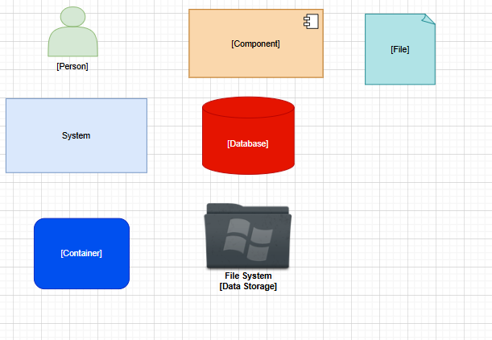
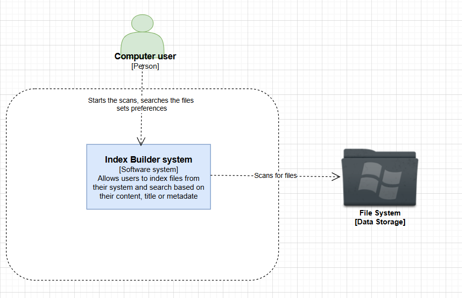
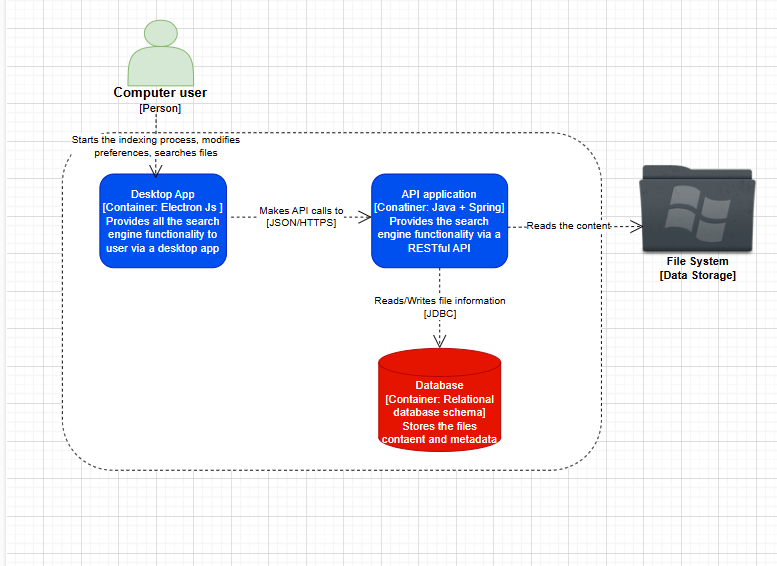
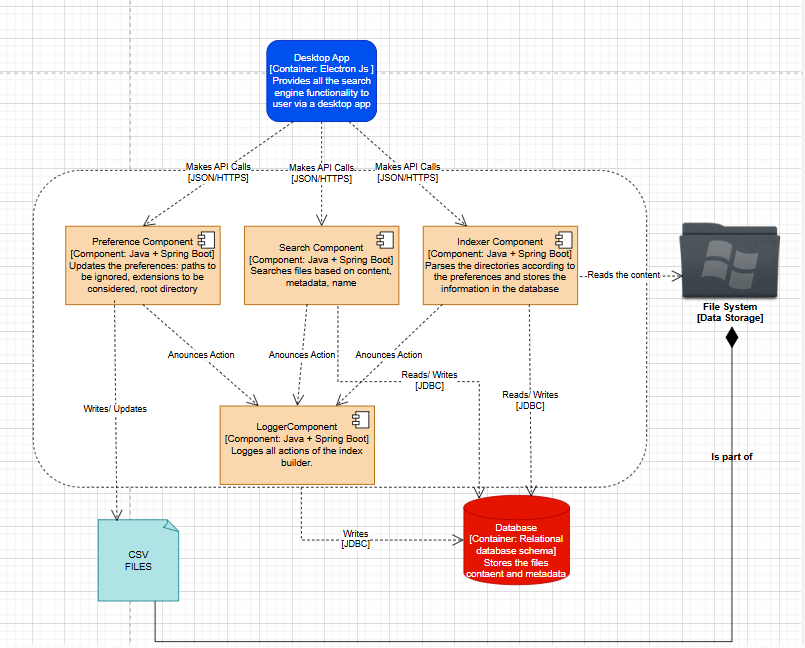
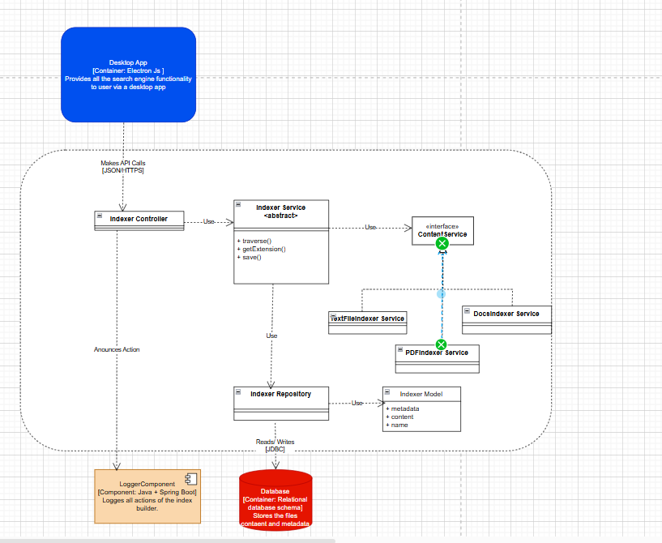
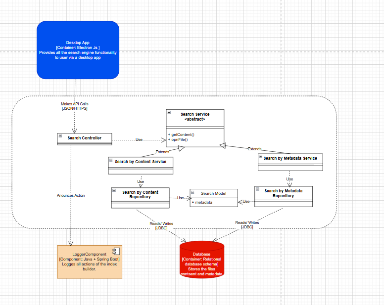
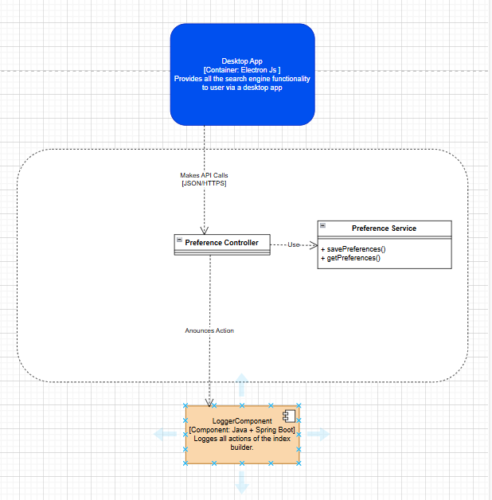

# Architecture of the index builder

## The scope
The scope of this project is to build an index builder for the files located on the local disk of the user. This file would contain the description of the overall architecture of the application.

## The C4 model 
The C4 model describes the architecture similar to how an online map would describe an area: zooming in and zooming out. In this context the C4 architecture confers 4 levels of description for the software system: 
*   System Contex: describes the environment of the system and the components with which the system interacts;
*   Container level: describes the main high-level technologies and shape of the software system and how reponsabilities are distributed across it;
*   Component level: describes how the roles of a container are distributed acress its components and how they comunicate with each other;
*   Classes or code level: describes the design of each component, the separation in classes and interfaces.

## Legend

Other symbol that are used are UML symbols which are documented [here](https://www.tutorialspoint.com/uml/uml_basic_notations.htm).

### The system contex
 
Our system interacts with the local user of the computer and the file system of the computer.

### The Container level

 

The main containers of our system are: the ***Desktop App***, responsible for the interaction with the user, the ***Api application***, containing the business logic and exposing the busines logic via a RESTful API, and a ***Relational Database*** used to store the information of the files.

### The Component level

 

The backend is divided into 4 main components:
*   The **logger**: responsible for tracking all the actions performed by the application;
*   The **preference component**: which deals with the prefences that can be set by the user;
*   The **indexer**: which traverse the file system and indexes the files into the system;
*   The **search** component: which deals with the retrieval of information from the files.

### Class/Code Level

Usually this level is not recomended to be drawed, due to the high chance of changes that may appear at this level, but rather generated directly using an IDE. Having said that below are the current Class diagrams for the main components of the backend.
---
 
---

---
---
